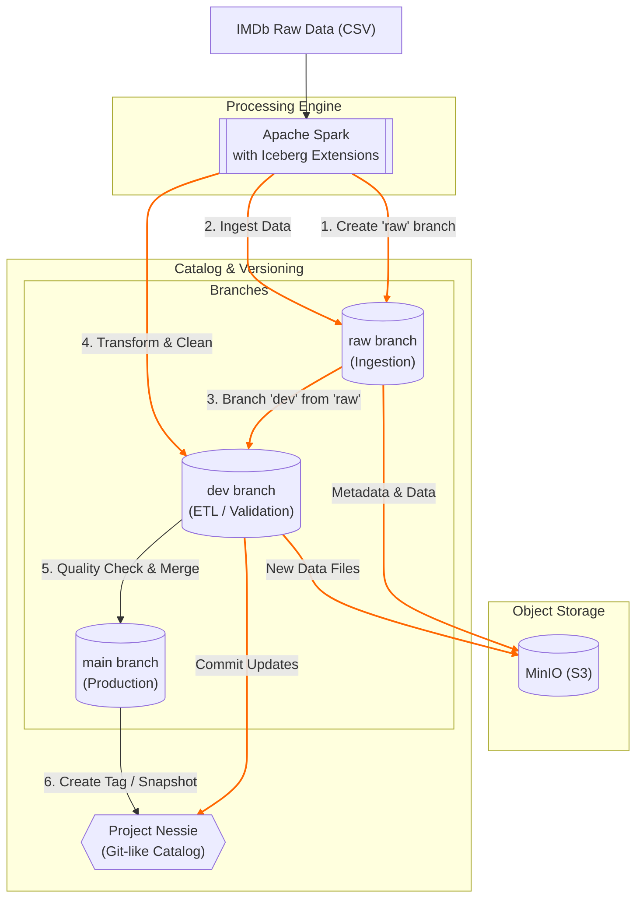

Versioned Data Lakehouse and Atomic ETL Pipeline with Nessie, Iceberg, and Spark
===========================================================

    

This project demonstrates how to build a versioned data lakehouse with an atomic version-controlled ETL pipeline using Project Nessie as the catalog provider, Apache Iceberg for table format, and Apache Spark for processing. It shows how to apply Git-like version control to your data engineering workflows, similar to how Git manages your code.

## Project Flow

